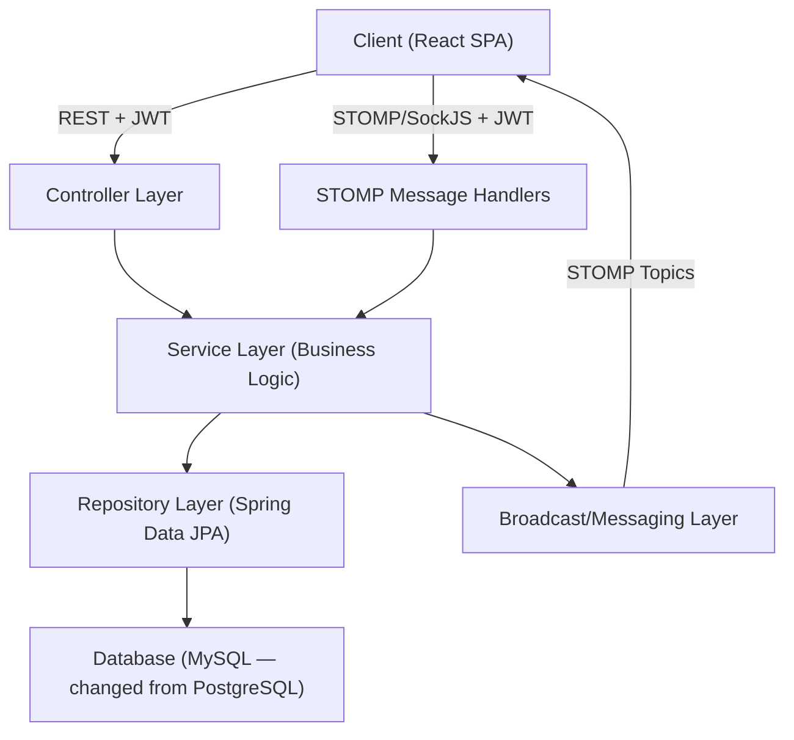

# SyncBoard — Deep Project Analysis

## 1. Project Overview

**SyncBoard** is a **real-time collaborative Kanban board** designed as a portfolio/learning project showcasing modern full-stack engineering: Spring Boot + React + WebSockets (STOMP over SockJS).

> [!IMPORTANT]
> **Current status: Pre-implementation / Planning phase only.** No source code exists yet — the repo contains only planning documents, reference images, and a PDF. The project is at **Phase 0** of a 7-phase build plan.

---

## 2. Complete File & Directory Inventory

```
sync_board/                           (root)
├── .git/                             (Git repository — 3 commits, 1 merged PR)
├── Architecture.md                   (18,147 bytes — 326 lines)
├── Phases.md                         (13,840 bytes — 181 lines)
├── README.md                         (1,735 bytes — 64 lines)
├── Rules.md                          (15,851 bytes — 197 lines)
├── SyncBoard-PRD.md                  (46,192 bytes — 606 lines)
└── docs/
    ├── images/
    │   ├── activity.png              (1.3 MB — activity feed UI reference)
    │   ├── members.png               (1.3 MB — members list UI reference)
    │   ├── settings.png              (1.2 MB — settings page UI reference)
    │   └── board/
    │       ├── boards-config.png     (1.4 MB — board config UI reference)
    │       ├── boards.png            (1.2 MB — board view UI reference)
    │       └── create-new-board.png  (1.2 MB — create board UI reference)
    └── materials/
        └── sync_board.pdf            (344 KB — project reference material)
```

**Total files:** 11 files (5 markdown docs, 6 images, 1 PDF)
**Git history:** 3 commits across 2 branches (`main`, `docs/documentation`) with 1 merged PR

---

## 3. Document-by-Document Analysis

### 3.1 [README.md](file:///d:/Project/sync_board/README.md)
| Aspect | Assessment |
|--------|-----------|
| **Purpose** | Project introduction with features list and tech stack |
| **Quality** | Clean, well-structured, concise |
| **Issue** | Lists **PostgreSQL** and **Docker/Docker Compose** in tech stack — needs update for MySQL |
| **Gap** | No setup instructions yet (expected — project hasn't started) |

### 3.2 [SyncBoard-PRD.md](file:///d:/Project/sync_board/SyncBoard-PRD.md)
| Aspect | Assessment |
|--------|-----------|
| **Purpose** | Comprehensive Product Requirements Document (22 sections, 606 lines) |
| **Quality** | **Exceptionally thorough.** Covers executive summary, personas, scope, architecture, data model, feature modules, user workflows, real-time design, API surface, roles/permissions, NFRs, UI specs, edge cases, security, roadmap, testing, deployment, and glossary |
| **Strengths** | Clear separation of ephemeral vs. durable events; detailed conflict-resolution workflows; deliberate "single-server first" philosophy |
| **Issues** | References **PostgreSQL** in §6.1, §7 tech stack table, §20 deployment — all need MySQL updates |

### 3.3 [Architecture.md](file:///d:/Project/sync_board/Architecture.md)
| Aspect | Assessment |
|--------|-----------|
| **Purpose** | Technical blueprint — system layers, folder structures, data flows, tech stack |
| **Quality** | **Production-grade planning.** Excellent layered architecture (Controller → Service → Repository → Broadcast), clear module boundaries, well-defined backend/frontend folder structures |
| **Strengths** | REST lifecycle and WebSocket/STOMP lifecycle documented separately; config/environment strategy defined; Docker layout specified |
| **Issues** | References **PostgreSQL** throughout (§1, §2, §9 tech stack table, §10 Docker layout); Docker Compose described with `db` service as PostgreSQL container |

### 3.4 [Phases.md](file:///d:/Project/sync_board/Phases.md)
| Aspect | Assessment |
|--------|-----------|
| **Purpose** | 8-phase development checklist (Phase 0–7) |
| **Quality** | **Excellent.** Each phase has: goal, task checklist, "done when" criteria, and pitfall warnings |
| **Strengths** | Smart sequencing — CRUD before real-time; checklist-driven; concrete exit criteria |
| **Issues** | Phase 0 says "Set up the local PostgreSQL instance via Docker Compose" — needs rewrite for local MySQL |

### 3.5 [Rules.md](file:///d:/Project/sync_board/Rules.md)
| Aspect | Assessment |
|--------|-----------|
| **Purpose** | Engineering rulebook — do's, don'ts, library guidance, error handling, naming, git practices |
| **Quality** | **Very strong.** 12 sections covering backend/frontend conventions, module boundaries, ephemeral vs. durable event taxonomy, naming, git practices, and a pre-merge self-checklist |
| **Issues** | No direct PostgreSQL references, but the "don't use raw JDBC or hand-rolled SQL" rule in §3 references Spring Data JPA only (still valid for MySQL) |

### 3.6 Reference Images (docs/images/)
Six UI mockup/reference images covering:
- Board view, board config, board creation
- Activity feed, members list, settings page

These serve as UI design targets. No issues.

### 3.7 Reference PDF (docs/materials/sync_board.pdf)
A 344KB supplementary document — likely a project overview or design reference.

---

## 4. Architecture Assessment

### 4.1 Backend Architecture (Spring Boot)



**Modules defined:** `auth`, `user`, `workspace`, `board`, `card`, `comment`, `presence`, `notification`, `activity`, `common`, `config`, `security`

**Cross-cutting concerns:** JWT security filter, global exception handler, session registry

> [!TIP]
> The modular monolith approach is excellent for this project scope. Each module owns its entity → repository → service → controller → DTO chain.

### 4.2 Frontend Architecture (React)

**Organization:** Feature-based (`auth`, `workspace`, `board`, `cardDetail`, `presence`, `notifications`, `activity`) with shared components and a dedicated WebSocket layer.

**Key patterns planned:**
- Optimistic updates with server reconciliation
- Single WebSocket connection per session
- Feature-based state management
- Centralized Axios interceptors for auth

### 4.3 Real-Time Design

| Concern | Approach |
|---------|----------|
| **Protocol** | STOMP over SockJS |
| **Topics** | Per-workspace, per-board, per-card (optional), per-user, presence |
| **Presence** | Heartbeat-based (15-30s interval) with grace period for silent drops |
| **Concurrency** | Optimistic locking via version field on Card entity |
| **Soft-lock** | Advisory "currently editing" broadcast (non-blocking) |
| **Reconnect** | Full resync via REST on reconnect (no event replay) |

---

## 5. PostgreSQL → Local MySQL Migration Impact

> [!IMPORTANT]
> The user wants to switch from **PostgreSQL (via Docker Compose)** to **Local MySQL** (running natively on the machine, not containerized). This is a significant infrastructure change that touches multiple documents and will affect implementation choices.

### 5.1 What Changes

| Area | PostgreSQL (Current Plan) | MySQL (New Plan) |
|------|--------------------------|------------------|
| **Database** | PostgreSQL in Docker container | MySQL installed locally |
| **Infrastructure** | Docker Compose manages DB lifecycle | MySQL runs as a local Windows service |
| **Driver** | `postgresql` JDBC driver | `mysql-connector-j` JDBC driver |
| **Connection URL** | `jdbc:postgresql://localhost:5432/syncboard` | `jdbc:mysql://localhost:3306/syncboard` |
| **Docker Compose** | 3 services: `db` + `backend` + `frontend` | 2 services: `backend` + `frontend` (DB is external) |
| **Dialect** | PostgreSQL dialect in JPA | MySQL dialect in JPA |
| **Dependencies** | `org.postgresql:postgresql` | `com.mysql:mysql-connector-j` |

### 5.2 Documents Requiring Updates

| Document | Lines/Sections to Update |
|----------|------------------------|
| [README.md](file:///d:/Project/sync_board/README.md) | Line 46: `PostgreSQL` → `MySQL`; Lines 50-51: Remove Docker/Docker Compose from DevOps or clarify scope |
| [SyncBoard-PRD.md](file:///d:/Project/sync_board/SyncBoard-PRD.md) | §6.1 (line 158): "one PostgreSQL instance"; §7 tech stack table (line 210); §20 deployment (line 574) |
| [Architecture.md](file:///d:/Project/sync_board/Architecture.md) | §1 (line 26): "one PostgreSQL instance"; §2 persistence layer (line 32); §8 config (line 287): "local Docker Compose database URL"; §9 tech stack table (line 307); §10 Docker layout (lines 315-321): Remove `db` service |
| [Phases.md](file:///d:/Project/sync_board/Phases.md) | Phase 0 (line 24): "Set up the local PostgreSQL instance via Docker Compose" → "Set up the local MySQL instance"; Phase 7 (line 151): Docker Compose description |

### 5.3 Technical Considerations for MySQL

> [!WARNING]
> **JPA/Hibernate differences to be aware of:**
> - MySQL uses `AUTO_INCREMENT` vs PostgreSQL's `SERIAL`/sequences — set `spring.jpa.properties.hibernate.id.new_generator_mappings=true` and use `GenerationType.IDENTITY`
> - MySQL's default `utf8` only supports 3-byte chars; use `utf8mb4` charset for full Unicode support
> - MySQL's `TEXT` type behavior differs from PostgreSQL — consider `VARCHAR(n)` with explicit lengths
> - MySQL's default transaction isolation is `REPEATABLE_READ` (vs PostgreSQL's `READ_COMMITTED`) — be explicit in config
> - MySQL doesn't support `RETURNING` clause — minor JPA impact
> - `@Version` optimistic locking works identically on both — no change needed

> [!TIP]
> **Recommended MySQL setup for this project:**
> ```yaml
> # application-local.yml
> spring:
>   datasource:
>     url: jdbc:mysql://localhost:3306/syncboard?useSSL=false&serverTimezone=UTC&characterEncoding=utf8mb4
>     username: ${MYSQL_USER:root}
>     password: ${MYSQL_PASSWORD:yourpassword}
>     driver-class-name: com.mysql.cj.jdbc.Driver
>   jpa:
>     database-platform: org.hibernate.dialect.MySQLDialect
>     hibernate:
>       ddl-auto: update
>     properties:
>       hibernate:
>         format_sql: true
> ```

### 5.4 Docker Compose Impact

The `docker-compose.yml` simplifies — the `db` service is removed entirely since MySQL runs locally:

```yaml
# Before: 3 services (db, backend, frontend)
# After:  2 services (backend, frontend) — DB is external

services:
  backend:
    build: ./syncboard-backend
    ports:
      - "8080:8080"
    environment:
      - SPRING_DATASOURCE_URL=jdbc:mysql://host.docker.internal:3306/syncboard
      # host.docker.internal lets containerized backend reach host MySQL
    # No depends_on: db anymore

  frontend:
    build: ./syncboard-frontend
    ports:
      - "3000:3000"
```

> [!NOTE]
> If the backend is also run locally (not in Docker), the Docker Compose may only be needed for the frontend build, or not at all during development. Consider simplifying to just `npm run dev` + `mvn spring-boot:run` for local dev.

---

## 6. Strengths of the Current Planning

1. **Documentation quality is exceptional** — the PRD alone (606 lines, 22 sections) covers everything from personas to edge cases to a glossary
2. **Architecture is well-thought-out** — modular monolith with clear layer boundaries, feature-based frontend organization mirroring backend modules
3. **Phase plan is realistic** — incremental, checklist-driven, with concrete exit criteria and pitfall warnings
4. **Real-time design is sophisticated** — ephemeral/durable event taxonomy, heartbeat-based presence, optimistic concurrency + soft-lock dual mechanism
5. **Rules document prevents common mistakes** — explicit do's/don'ts for both backend and frontend, library guidance, pre-merge checklist
6. **UI reference images exist** — 6 screenshots providing visual targets

---

## 7. Gaps & Recommendations

| # | Gap | Recommendation |
|---|-----|----------------|
| 1 | **No source code exists yet** | Begin Phase 0: project skeleton setup |
| 2 | **PostgreSQL references everywhere** | Update all 4 documents to reference MySQL (see §5.2 above) |
| 3 | **Docker Compose is over-scoped** | Simplify: remove `db` service, or consider not using Docker at all for local dev |
| 4 | **No Design.md referenced** | Architecture.md §5 references `Design.md` for design tokens — this file doesn't exist yet |
| 5 | **No `.gitignore`** | Add `.gitignore` for Java (Maven/Gradle), Node.js, IDE files, and environment files |
| 6 | **No `pom.xml` or `build.gradle`** | Needed in Phase 0 — must include `mysql-connector-j` instead of PostgreSQL driver |
| 7 | **No `package.json`** | Needed in Phase 0 for the React frontend |
| 8 | **No environment template** | Add `.env.example` with placeholder values for MySQL credentials, JWT secret, etc. |

---

## 8. Summary & Next Steps

The project is in an **excellent planning state** — the documentation is thorough, well-structured, and production-grade. The main action item before starting Phase 0 is:

1. **Update all documents** to replace PostgreSQL/Docker Compose references with local MySQL
2. **Initialize the Spring Boot backend** with MySQL driver (`mysql-connector-j`) instead of PostgreSQL
3. **Initialize the React frontend** with the planned tech stack
4. **Set up local MySQL** — create the `syncboard` database with `utf8mb4` charset
5. **Establish the folder structure** from Architecture.md

> [!NOTE]
> Would you like me to proceed with updating all the documents to replace PostgreSQL with local MySQL? I can make all the changes across README.md, SyncBoard-PRD.md, Architecture.md, and Phases.md in one pass.
